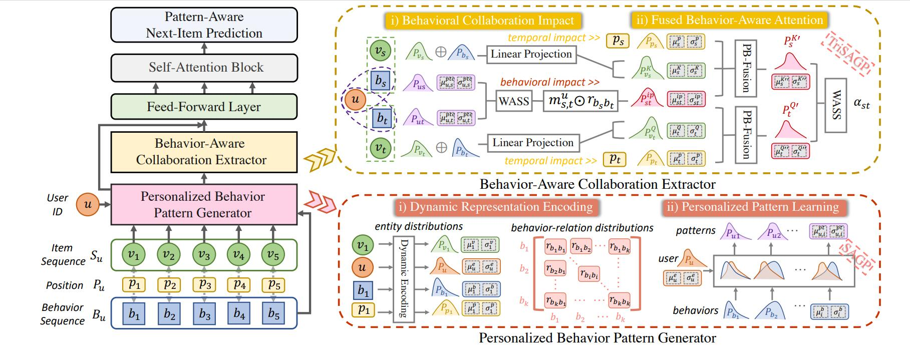

<h1 align="center">
Personalized Behavior-Aware Transformer for Multi-Behavior Sequential Recommendation
</h1>
This is the implementation for the paper "Personalized Behavior-Aware Transformer for Multi-Behavior Sequential Recommendation", ACM Multimedia 2023.


</div>

</div>

## Quick Start
1. install pytorch and other dependencies
```bash
conda create -n PBAT python=3.8   
conda activate PBAT      
pip install -r requirements.txt
pip install "jsonargparse[signatures]"
```
2. run the model with a `yaml` configuration file like following:
```bash
python run.py fit --config src/configs/retail.yaml
```

## Dataset
Due to file size limitations, we have not uploaded all of the data. You can download the datasets from [releases](https://github.com/Shengxiang-Lin/PBAT/releases).

## Log View   
```bash
pip install tensorboard==2.14.0
pip install protobuf==3.20.3.3
cd logs/yelp/full/lightning_logs/version_0   
tensorboard --logdir=.
```
Then open http://localhost:6006/    
 
## Citation
If you find the code helpful, please cite us as:
```
@inproceedings{DBLP:conf/mm/Su0LLLZ23,
  author       = {Jiajie Su and
                  Chaochao Chen and
                  Zibin Lin and
                  Xi Li and
                  Weiming Liu and
                  Xiaolin Zheng},
  editor       = {Abdulmotaleb El{-}Saddik and
                  Tao Mei and
                  Rita Cucchiara and
                  Marco Bertini and
                  Diana Patricia Tobon Vallejo and
                  Pradeep K. Atrey and
                  M. Shamim Hossain},
  title        = {Personalized Behavior-Aware Transformer for Multi-Behavior Sequential
                  Recommendation},
  booktitle    = {Proceedings of the 31st {ACM} International Conference on Multimedia,
                  {MM} 2023, Ottawa, ON, Canada, 29 October 2023- 3 November 2023},
  pages        = {6321--6331},
  publisher    = {{ACM}},
  year         = {2023},
  url          = {https://doi.org/10.1145/3581783.3611723},
  doi          = {10.1145/3581783.3611723},
  timestamp    = {Fri, 15 Dec 2023 14:50:53 +0100},
  biburl       = {https://dblp.org/rec/conf/mm/Su0LLLZ23.bib},
  bibsource    = {dblp computer science bibliography, https://dblp.org}
}
```
## Acknowledgements
Our code is based on the implementation of [MB-STR](https://github.com/yuanenming/mb-str).
